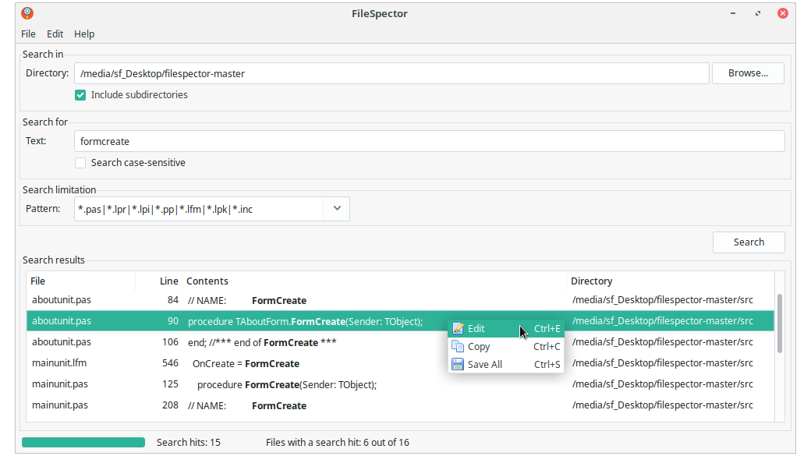

# FileSpector

FileSpector is a GUI tool for quickly finding all text occurrences in multiple files in a directory, matching a specific file extension pattern. It is developed for GNU/Linux systems. Its focus is on simplicity and easy-of-use, as opposed to feature-rich.

Double-clicking a line in the search results, opens the file in the text editor at the line containing the search term. FileSpector automatically detects the text editor installed on your GNU/Linux system.

A wide range of command-line options are supported, making it possible to integrate FileSpector with existing tools. You could for example add a "Find in Files" option to your file manager's pop-up menu, after right-clicking a directory.

## Installation

The easiest way to install FileSpector is to head over to the [Releases](https://github.com/kruizer23/filespector/releases/) page. From there you can download DEB and RPM packages for most popular GNU/Linux distributions, such as Debian, Ubuntu, Fedora and openSUSE. If no package is available for your distribution, you can build and install FileSpector directly from source code. This procedure is described further down on this page.

## Dependencies

The packages **find**, **grep** and **which** are needed to run FileSpector. These are installed by default on most GNU/Linux distributions.

## Building from source

The [Lazarus IDE](https://www.lazarus-ide.org/) was used to develop FileSpector. To install Lazarus, you can download DEB and RPM packages from [SourceForge](https://sourceforge.net/projects/lazarus/files/). However, it is recommended to install the version of Lazarus that is present in the package repositories of your GNU/Linux distribution. Here are the Lazarus installation instructions for most popular GNU/Linux distributions:

**Debian**: `sudo apt install make gdb fpc fpc-source lazarus`

**Ubuntu**: `sudo apt install make gdb fpc fpc-source lazarus lcl`

**Fedora**: `sudo dnf install make gdb fpc fpc-src lazarus`

**openSUSE**: `sudo zypper install make gdb fpc fpc-src lazarus`

Once Lazarus in installed, you can build FileSpector from the terminal using the following command:

**`make clean all`**

After successfully building FileSpector, you can install it from the terminal using the following command:

**`sudo make install`**

To remove FileSpector, you can run:

**`sudo make uninstall`**

## Development

For development work on FileSpector, it is recommended to work in the Lazarus IDE directly. Start Lazarus by selecting it from the application menu of your desktop environment. Next, select *Project → Open Project* from the program menu. Browse to the `./src` directory and select the `filespector.lpi` file. Build, run and debug FileSpector by simply clicking the green play-button in the toolbar or by selecting *Run → Run* from the program menu.

